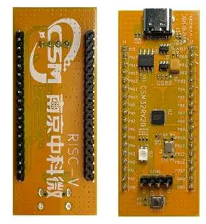
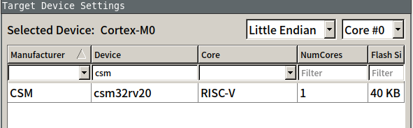
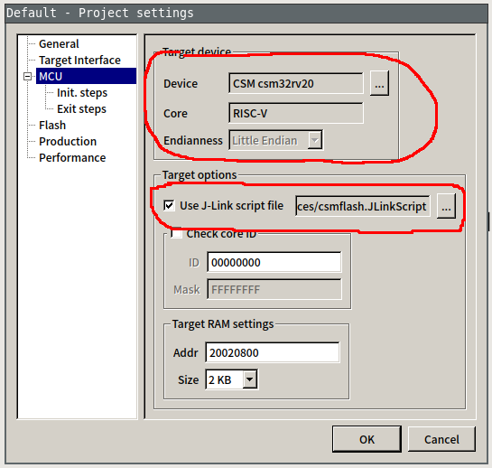

# Opensource toolchain tutorial for CSM32RV20

**Actually, there is no complete opensource toolchain for CSM32RV20, they forked OpenOCD to add CJ-Link and csm flash driver support, renamed it to  "cjlink" but closed sources. This violated GPL license that OpenOCD followed.**


CSM32RV20 is a low-power MCU chip based on RISC-V core, made by Nanjing zhongke microelectronics .
- Built-in RISC-V RV32IMAC core (2.6 CoreMark/MHz);
- Up to 32MHz working frequency;
- Built-in 4kB SRAM;
- Built-in 8B ALWAYS register, which can save data in power-down mode 2;
- Built-in 40kB embedded FLASH, 512B NVM, which can be erased and written at least 10,000 times;
- Built-in 2 SPI MASTER;
- Built-in 1 I2C MASTER;
- Built-in 4 UARTs support up to 1Mbps;
- Built-in 2 TIMERs, each TIMER supports 4 complementary PWM outputs;
- Built-in a fast high-precision 13/14/15/16bit ADC, integrated 1.2V high-precision reference;
- Wide ADC input voltage range: 0 ~ VDD (VDD ≤ 4.8V);
- ADC supports 11 input channels and supports up to 9 touch keys;
- Built-in 3 fast comparators;
- Built-in low voltage detection module;
- Built-in RF detection module;
- Support up to 30 GPIOs, of which the PA port supports external interrupts (up to 16 external interrupts);
- Built-in hardware watchdog;
- Built-in 1 RTC, does not work in power-down mode 2;
- Support 4 low power consumption modes, the lowest power consumption is less than 1uA (watchdog working);
- Built-in 32-bit true random number generator;
- Support serial port and wireless ISP online upgrade (wireless ISP needs an external Si24R1);
- Support cJTAG 2-wire debug interface;
- Operating voltage range: 1.8 ~ 5.5V;
- Supports 4x4mm QFN32, TSSOP20 and 3x3mm QFN20 packages.

It provide limited Linux support with CSMStudio linux version, but comparing with CSMStudio window version, the linux version is outdated, can not run due to compatibility, lack cjlink support, JLink not works, close source, etc. In short, it not worked as expected.

**NOTE :** There is another firmware library provided in CSMStudio for 'Shanghai WestBerry WB32F030', after diff with CSM32RV20 firmware library v1.2.0, both are exactly identical, these two MCUs are same with different brand.

# Table of contents
- [Hardware prerequiest](https://github.com/cjacker/opensource-toolchain-csm32rv20/#hardware-prerequiest)
- [Toolchain overview](https://github.com/cjacker/opensource-toolchain-csm32rv20/#toolchain-overview)
- [Compiler](https://github.com/cjacker/opensource-toolchain-csm32rv20/#compiler)
  + [XPack RISC-V Toolchain](https://github.com/cjacker/opensource-toolchain-csm32rv20/#xpack-risc-v-toolchain)
- [SDK](https://github.com/cjacker/opensource-toolchain-csm32rv20/#sdk)
- [Programming](https://github.com/cjacker/opensource-toolchain-csm32rv20/#programming)
- [Debugging](https://github.com/cjacker/opensource-toolchain-csm32rv20/#debugging)
- [Project template](https://github.com/cjacker/opensource-toolchain-csm32rv20/#project-template)

# Hardware prerequiest
- Official EVB
- Any JLink adapter(above v10)



# Toolchain overview
- Compiler : RISC-V GNU Toolchain
- SDK : official firemware library
- Programming : JLink by cJTAG interface
- Debugging : JLink GDB Server / gdb

# Compiler

As other RV32IMAC based RISC-V MCU, there are a lot of prebuilt riscv toolchains you can download and use it directly.

## XPack RISC-V toolchain

[xpack-dev-tools](https://github.com/xpack-dev-tools/riscv-none-elf-gcc-xpack/) provde a prebuilt toolchain for riscv. you can download it from https://github.com/xpack-dev-tools/riscv-none-elf-gcc-xpack/. The lastest version is '12.2.0', Download and extract it:

```
sudo mkdir -p /opt/xpack-riscv-toolchain
sudo tar xf xpack-riscv-none-elf-gcc-12.2.0-3-linux-x64.tar.gz -C /opt/xpack-riscv-toolchain --strip-components=1
```

And add `/opt/xpack-riscv-toolchain/bin` to PATH env according to your shell.

**NOTE**, the target triplet of xpack riscv toolchain is **`riscv-none-elf`**.

You can also use the deprecated `riscv-none-embed` toolchain from XPack, the installation is same as `riscv-none-elf` toolchain, both work good.

# SDK

The firmware library is provided within CSMStudio, up to now, there is 3 version exposed, V1.0.0 and V1.2.0 is in CSMStudio Linux version, and V1.7.0 is the most latest version in CSMStudio Window version. 

I use the latest V1.7.0 version and all resources include datasheets (only have CN edition) and my changes to make it build had been put in [this seperate firmware library repo](https://github.com/cjacker/csm32rv20_firmware_library).

```
git clone https://github.com/cjacker/csm32rv20_firmware_library.git
```

Type `make` to build, if all good, the `csm32rv20.hex / .elf / .bin` files will be generated at `build` dir.


# Programming

Upstream support programming by ISP, JLink and CJLink.

ISP programming depends on a close-source software written in dotNet, currently not work on Linux.

CJLink support is by a privated forked OpenOCD with their own changes to add cjlink interface and csm flash driver, but not open source. it have only a windows binary released, also not work on Linux.

It's lucky that upstream also provide a JFlashloader, here I have to use **JLink with upstream JFlash support** although I don't like it.

In [this seperate firmware library repo](https://github.com/cjacker/csm32rv20_firmware_library), I already integrated JLink programming support for it. before use JLink programming, you should have JLink utilities installed first, download it from SEGGER and install it.

There are something need to explain:

## Add JFlash support

Recent version of JLink support adding JFlash support for new devices by put it to `$HOME/.config/SEGGER/JLinkDevices/<Vendor>/<Series>` dir.

- Create a dir `$HOME/.config/SEGGER/JLinkDevices/<Vendor>/<Series>`
```
mkdir -p $HOME/.config/SEGGER/JLinkDevices/CSM/csm32rv20
```

- Copy "JFlashLoader" algo file to this dir.
```
cp Flashloader.elf $HOME/.config/SEGGER/JLinkDevices/CSM/csm32rv20
```

- Create database xml file `$HOME/.config/SEGGER/JLinkDevices/CSM/csm32rv20/JLinkDevices.xml` as:
```
<DataBase>
   <Device>
   <ChipInfo Vendor="CSM" Name="csm32rv20" Core="JLINK_CORE_RISC_V" WorkRAMAddr="0x20020800" WorkRAMSize="0x00000800" />
   <FlashBankInfo Name="Internal Flash" BaseAddr="0x20000000" MaxSize="0x0000A000" Loader="Flashloader.elf" LoaderType="FLASH_ALGO_TYPE_OPEN" AlwaysPresent="1" />
  </Device>
</DataBase>
```

If all good, the devices should able to be selected by vairous JLink utilities. I write a 'import-csm-jflash' script in firmware library repo to do this automatically.



## Prepare csmflash.JLinkScript

After JFlash support added, you also have to perpare a JLink script `csmflash.JLinkScript` for csm32rv20, refer to "Short connect sequence' section of https://wiki.segger.com/J-Link_cJTAG_specifics :

> By default, J-Link will use the standard connect sequence. 
> In order to make J-Link to use the short one instead, a command string needs to be executed before connecting to the device: "SetcJTAGInitMode = 1". 

**It is important, otherwise JLink utilities will fail to connect CSM32RV20.**

The script content as below:

```
int ConfigTargetSettings(void) {
  JLINK_ExecCommand("SetcJTAGInitMode = 1");
  return 0;
}

/* original contents from CSMStudio */
int InitTarget(void) {
  JLINK_ExecCommand("SetCompareMode = 0");
  JLINK_ExecCommand("SetVerifyDownload = 0");
  JLINK_ExecCommand("SetSkipProgOnCRCMatch= 0");
  return 0;
}
```

## Prepare flash.jlink JLink commandfile

Here I use `JLinkExe` to program since it doesn't require GUI, create a flash.jlink as :

```
loadfile build/csm32rv20.hex
exit
```

## Program
Wire up JLink adapter and Official EVB cJTAG interface as:

| JLink | CSM32RV20 |
|-------|-----------|
| VRef  | 3v3       |
| GND   | GND       |
| TMS   | TMSC      |
| TCK   | TCKC      |

You can use JFlash (not JFlashLite) to program csm32rv20, choose the 'cJTAG' interface, set up the device and select 'csmflash.JLinkScript':



Here I use the command line:
```
JLinkExe -device csm32rv20 -if cJTAG -speed 4000 -jtagconf -1,-1 -JLinkScriptFile ./Devices/csmflash.JLinkScript -autoconnect 1 -nogui 1 -commandfile flash.jlink
```

The output looks like:
```
Device "CSM32RV20" selected.

Connecting to target via cJTAG
ConfigTargetSettings() start
ConfigTargetSettings() end - Took 0ms
InitTarget() start
InitTarget() end - Took 0ms
TotalIRLen = 5, IRPrint = 0x01
JTAG chain detection found 1 devices:
 #0 Id: 0x00000001, IRLen: 05, Unknown device
Debug architecture:
  RISC-V debug: 0.13
  AddrBits: 7
  DataBits: 32
  IdleClks: 5
Memory access:
  Via system bus: No
  Via ProgBuf: Yes (2 ProgBuf entries)
  Via abstract command (AAM): May be tried as last resort
DataBuf: 1 entries
  autoexec[0] implemented: Yes
Detected: RV32 core
Temp. halting CPU for for feature detection...
HW instruction/data BPs: 4
Support set/clr BPs while running: No
HW data BPs trigger before execution of inst
CSR access via abs. commands: No
Feature detection done. Restarting core...
BG memory access support: No
Memory zones:
  Zone: "Default" Description: Default access mode
RISC-V identified.
'loadfile': Performing implicit reset & halt of MCU.
RISC-V: Performing reset via <ndmreset>
Downloading file [build/csm32rv20.hex]...
Comparing flash   [100%] Done.
Erasing flash     [100%] Done.
Programming flash [100%] Done.
J-Link: Flash download: Bank 0 @ 0x20000000: 1 range affected (7680 bytes)
J-Link: Flash download: Total: 5.055s (Prepare: 0.799s, Erase: 0.818s, Program: 3.340s, Restore: 0.097s)
J-Link: Flash download: Program speed: 2 KB/s
O.K.
J-Link>exit

Script processing completed.
```

After programmed, the LED on official EVB should blink.


# Debugging

If we can use JLink to program, then we can always use it for debugging.

Run `JLinkGDBServerCLExe` as:
```
JLinkGDBServerCLExe -select USB -device csm32rv20 -endian little  -timeout 4000 -novd -if cJTAG -s -speed 4000 -ir -LocalhostOnly  -JLinkDevicesXMLPath `pwd`/Devices/ -jlinkscriptfile `pwd`/Devices/csmflash.JLinkScript
```

The output looks like:
```
Checking target voltage...
Target voltage: 3.27 V
Listening on TCP/IP port 2331
Connecting to target...

J-Link found 1 JTAG device, Total IRLen = 5
JTAG ID: 0x00000001 (RISC-V)
Halting core...
RISC-V RV32 detected. Using RV32 register set for communication with GDB
Core implements no FPU
Initializing CPU registers...Connected to target
Waiting for GDB connection...
```

NOTE `Listening on TCP/IP port 2331`, port 2331 will be used later.


Open new terminal window and run:
```
riscv-none-elf-gdb build/csm32rv20.elf
```

After '(gdb)` prompt show:
```
(gdb) target remote :2331
Remote debugging using :2331
warning: Can not parse XML target description; XML support was disabled at compile time
0x00000000 in ?? ()
(gdb) load
Loading section .init, size 0x126 lma 0x20000000
Loading section .text, size 0x1a0c lma 0x20000140
Loading section .rodata, size 0x138 lma 0x20001b4c
Loading section .data, size 0x64 lma 0x20001c84
Start address 0x20000000, load size 7374
Transfer rate: 1800 KB/sec, 1843 bytes/write.
(gdb) list main.c:50
45          //GPIO_Write(GPIOA,PIN14,GPIO_RESET); //GPIO 输出
46          //GPIO_Write(GPIOA,PIN15,GPIO_RESET); //GPIO 输出
47
48          //GPIO_Toggle(GPIOA,PIN15); //GPIO 翻转
49          //GPIO_MODE_Init(GPIOA,PIN15,GPIO_MODE_INTPUT); //GPIO 模式
50          for(uint8_t i=0;i<10;i++)
51          {
52              GPIO_Toggle(GPIOA,PIN8); //GPIO 翻转
53              Delay32M_ms(100);
54          }
(gdb) b 53
Breakpoint 1 at 0x2000016e: file src/main.c, line 53.
(gdb) c
Continuing.

Breakpoint 1, main () at src/main.c:53
53              Delay32M_ms(100);
(gdb)
```

# Project template
The firmware library is also project template.

To build:
```
make
```

To program:
```
make flash
```

To debug:
```
make debug
```
